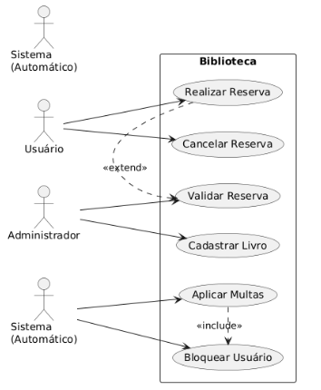
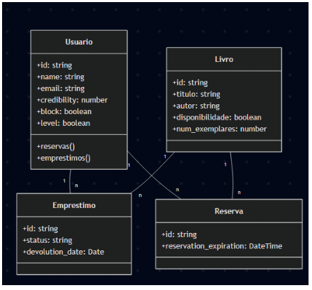
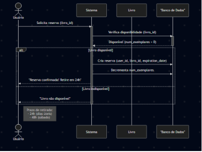

# README - Sistema de Biblioteca Virtual

## 👩‍💻 Autora
**Yasmim Russi Mariano**  
TADS 24 - Instituto Federal do Paraná  
Disciplina: Desenvolvimento Web II  
Professor: Luiz Efigênio  
**Data de entrega**: 09/07/2025

## 📚 Visão Geral do Projeto
Sistema de gerenciamento de biblioteca desenvolvido em Laravel com:
- Controle de acesso RBAC (3 níveis de permissão)
- 7 casos de uso complexos com regras de negócio
- Modelagem de dados com 5 entidades e relacionamentos 1:1 e 1:N
- Integração autônoma com Google Books API (não vista em aula)

## 🛠 Tecnologias Implementadas
**Backend**:
- Laravel 11 (PHP 8.2)
- MySQL (Eloquent ORM)
- Autenticação (Sistema RBAC customizado)
- Tarefas agendadas (Commands + Cron)

**Frontend**:
- Bootstrap 5 (Design responsivo)
- JavaScript Vanilla (Integração com APIs)
- Swiper.js (Carrossel de livros)

**Integrações**:
- Google Books API (Autocompletar dados)
- Carbon (Gestão avançada de datas)

## 📋 Casos de Uso (7 implementados)
1. **Reserva Inteligente de Livros**  
   - Prazos diferenciados (24h úteis/48h fins de semana)
   - Bloqueio para usuários com reserva ativa

2. **Empréstimo com Validação**  
   - Bloqueio para usuários com multa
   - Sugestão de reserva quando exemplares esgotados

3. **Gestão de Multas Automatizada**  
   - Cron job diário que reduz 10 pontos/dia de atraso
   - Bloqueio automático para ≤0 pontos

4. **Integração Google Books API**  
   - Autocompletar metadados via ISBN
   - Importação automática de capas e sinopses

5. **Painel Administrativo**  
   - Filtros avançados por status
   - Gráficos de movimentação

6. **Autenticação Hierárquica**  
   - Cadastro com confirmação por e-mail
   - Redefinição de senha segura

7. **Bloqueio por Credibilidade**  
   - Automático ao atingir 0 pontos
   - Reativação manual requerida

## Diagrama de Caso de Uso


## Diagrama de Classe


## Diagrama de Sequencia


## Diagrama de


## 🔐 Sistema RBAC (Controle de Acesso)
| Perfil         | Permissões                                  |
|----------------|---------------------------------------------|
| Administrador  | CRUD livros/usuários, acessar todos os dados|
| Bibliotecário  | Gerenciar empréstimos, aplicar multas      |
| Usuário        | Reservar livros, ver histórico             |

**Middleware**:
```php
public function handle($request, Closure $next) {
    if (!auth()->check() || !auth()->user()->isAdmin()) {
        abort(403, 'Acesso negado');
    }
    return $next($request);
}
```

## 🚀 Como Executar
1. **Configuração inicial**:
```bash
git clone https://github.com/seu-usuario/biblioteca-virtual.git
cd biblioteca-virtual
cp .env.example .env
composer install
php artisan key:generate
```

2. **Banco de dados**:
```bash
php artisan migrate --seed
```

3. **Iniciar servidor**:
```bash
php artisan serve
npm run dev
```

4. **Testar tarefas agendadas**:
```bash
php artisan schedule:work
```

## 📌 Regras de Negócio
| Funcionalidade          | Regra                                      |
|-------------------------|--------------------------------------------|
| Reservas                | 24h (48h aos sábados)                     |
| Empréstimos             | 7 dias de duração                         |
| Multas                  | -10 pontos/dia de atraso                  |
| Bloqueio                | Automático ao atingir ≤0 pontos           |
| Limite de reservas      | 1 livro por usuário simultaneamente       |

## 📅 Cronograma
| Versão | Data       | Destaques                                  |
|--------|------------|--------------------------------------------|
| 1.0    | 17/05/2025 | Fluxo básico de reservas                   |
| 2.0    | 20/05/2025 | Integração com Google Books API            |
| 3.0    | 01/07/2025 | Sistema completo de multas automatizadas   |

## ✔️ Atendimento aos Requisitos
- ✅ 7 casos de uso complexos com regras de negócio
- ✅ 5 entidades com relacionamentos 1:N
- ✅ RBAC com 3 perfis de usuário
- ✅ Funcionalidade adicional (Google Books API)
- ✅ Modelagem completa e documentada
- ✅ Repositório Git com histórico coerente

