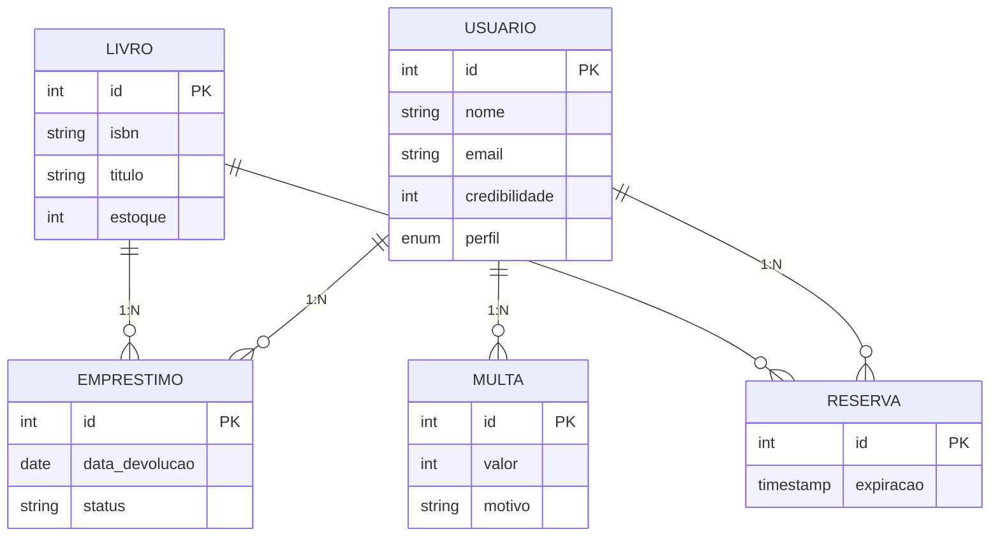

# README - Sistema de Biblioteca Virtual (Atualizado)

## 👩‍💻 Autora
**Yasmim Russi Mariano**  
TADS 24 - Instituto Federal do Paraná  
Disciplina: Desenvolvimento Web II  
Professor: Luiz Efigênio  
**Data de entrega**: 09/07/2025

## 📚 Visão Geral do Projeto
Sistema de gerenciamento de biblioteca desenvolvido em Laravel com:
- Controle de acesso RBAC (3 níveis de permissão)
- 7 casos de uso complexos com regras de negócio
- Modelagem de dados com 5 entidades e relacionamentos 1:1 e 1:N
- Integração autônoma com Google Books API (não vista em aula)


## 📋 Casos de Uso (7 implementados)

### 1. Reserva Inteligente de Livros
**Atores**: Usuário, Sistema  
**Fluxo Principal**:
1. Usuário autenticado seleciona livro disponível
2. Sistema verifica credibilidade (>0 pontos) e disponibilidade
3. Sistema aplica prazo diferenciado (24h úteis/48h fins de semana)

**Regras**:
- Bloqueia se usuário tem reserva ativa
- Atualiza estoque automaticamente

### 2. Empréstimo com Validação
**Atores**: Bibliotecário, Sistema  
**Fluxos Alternativos**:
- Se usuário com multa: bloqueia operação
- Se exemplares esgotados: sugere reserva

### 3. Gestão de Multas Automatizada
**Ator**: Sistema (cron job)  
**Disparo**: Diário às 00:00  
**Ações**:
- -10 pontos/dia de atraso
- Bloqueia usuários com ≤0 pontos

### 4. Integração Google Books API
**Ator**: Administrador  
**Funcionalidade**:
- Autocompletar metadados de livros via ISBN
- Capa e sinopse automáticas

### 5. Painel Administrativo
**Atores**: Administrador, Bibliotecário  
**Recursos**:
- Filtros avançados por status
- Gráficos de movimentação

### 6. Autenticação Hierárquica
**Fluxos**:
- Cadastro com confirmação por e-mail
- Redefinição de senha segura

### 7. Bloqueio por Credibilidade
**Regras**:
- Automático ao atingir 0 pontos
- Requer aprovação manual para reativação

✅ **Controle completo de reservas e empréstimos** com regras especiais para fins de semana  
✅ **Sistema de credibilidade** com penalidades automáticas por atrasos  
✅ **Processos automatizados** via tarefas agendadas (cron jobs)  
✅ **Painel administrativo** com filtros avançados  
✅ **Integração com API do Google Books** para cadastro automático  

## 🛠 Tecnologias Implementadas

**Backend**:
- **Laravel 11** (PHP 8.2)
- **MySQL** (Eloquent ORM)
- **Autenticação** (Sistema RBAC customizado)
- **Tarefas agendadas** (Commands + Cron)

**Frontend**:
- **Bootstrap 5** (Design responsivo)
- **JavaScript Vanilla** (Integração com APIs)
- **Swiper.js** (Carrossel de livros)

**Integrações**:
- **Google Books API** (Autocompletar dados)
- **Carbon** (Gestão avançada de datas)

## ⚙️ Funcionalidades Principais

### 1. Sistema Automatizado de Multas
```bash
php artisan schedule:work
```
- **Comando**: `ApplyFine.php`
- **Execução**: Diária às 00:00
- **Ações**:
  - Reduz 10 pontos de credibilidade por atraso
  - Atualiza status para "pendente"
  - Bloqueia usuários com ≤0 pontos (`BlockUsers.php`)

### 2. Reservas Inteligentes
```php
// ReservaController.php
if (date('w') == 6) { // Sábado
    $expiration = now()->addHours(48);
} else {
    $expiration = now()->addHours(24);
}
```
- Prazos diferenciados para fins de semana
- Atualização automática do estoque

### 3. Painel Administrativo
```php
// LoansController.php
public function panel() {
    return request('view') == 'history' 
        ? Loan::all() 
        : Loan::where('status', '!=', 'devolvido')->get();
}
```
- Filtros por status
- Visualização histórica

## 🔐 Sistema RBAC (Controle de Acesso)

| Perfil         | Permissões                                  |
|----------------|---------------------------------------------|
| Administrador  | CRUD livros/usuários, acessar todos os dados|
| Bibliotecário  | Gerenciar empréstimos, aplicar multas      |
| Usuário        | Reservar livros, ver histórico             |

**Middleware**:
```php
// AdminMiddleware.php
public function handle($request, Closure $next) {
    if (!auth()->check() || !auth()->user()->isAdmin()) {
        abort(403, 'Acesso negado');
    }
    return $next($request);
}
```

## 🗃 Modelagem de Dados (5 Entidades)


## 🔐 Sistema de Segurança

**AdminMiddleware.php**:
```php
public function handle($request, Closure $next) {
    return auth()->check() && auth()->user()->level 
        ? $next($request)
        : redirect('/')->with('Error', 'Acesso negado!');
}
```

**Proteções**:
- CSRF Token em todos os forms
- Validação server-side
- Hash de senhas (bcrypt)

## 🚀 Como Executar

1. **Configuração inicial**:
```bash
git clone https://github.com/seu-usuario/biblioteca-virtual.git
cd biblioteca-virtual
cp .env.example .env
composer install
php artisan key:generate
```

2. **Banco de dados**:
```bash
php artisan migrate --seed
```

3. **Testar tarefas agendadas**:
```bash
php artisan schedule:work
```

4. **Acessar**:
```
http://localhost:8000
```

## 📌 Regras de Negócio

| Funcionalidade          | Regra                                      |
|-------------------------|--------------------------------------------|
| Reservas                | 24h (48h aos sábados)                     |
| Empréstimos             | 7 dias de duração                         |
| Multas                  | -10 pontos/dia de atraso                  |
| Bloqueio                | Automático ao atingir ≤0 pontos           |
| Limite de reservas      | 1 livro por usuário simultaneamente       |

## 📅 Cronograma

| Versão | Data       | Destaques                                  |
|--------|------------|--------------------------------------------|
| 1.0    | 15/05/2025 | Fluxo básico de reservas                   |
| 2.0    | 20/05/2025 | Integração com Google Books API            |
| 3.0    | 01/07/2025 | Sistema completo de multas automatizadas   |


## 🖥️ Comandos Essenciais

### Instalação e Configuração Inicial

```bash
# Clonar repositório
git clone https://github.com/seu-usuario/biblioteca-virtual.git
cd biblioteca-virtual

# Instalar dependências PHP
composer install

# Instalar dependências JavaScript (Bootstrap, Swiper.js, etc.)
npm install

# Configurar ambiente (copiar .env e gerar chave)
cp .env.example .env
php artisan key:generate

# Criar banco de dados e tabelas
php artisan migrate

# Popular banco com dados de teste (opcional)
php artisan db:seed
```

### Desenvolvimento

```bash
# Iniciar servidor Laravel
php artisan serve

# Compilar assets frontend (em outra aba do terminal)
npm run dev

# Modo watch para desenvolvimento (recompila automaticamente)
npm run dev -- --watch

# Testar tarefas agendadas
php artisan schedule:work
```

### Comandos Personalizados do Sistema

```bash
# Executar manualmente o sistema de multas
php artisan ApplyFine

# Verificar e bloquear usuários com credibilidade zerada
php artisan BlockUsers

# Limpar reservas expiradas
php artisan DeleteReserveExpired
```

### Produção

```bash
# Compilar assets para produção
npm run build

# Otimizar aplicação
php artisan optimize

# Limpar caches (em caso de problemas)
php artisan optimize:clear
```

### Comandos Úteis para Debug

```bash
# Listar todas as rotas
php artisan route:list

# Verificar rotas administrativas
php artisan route:list --path=admin

# Monitorar logs em tempo real
tail -f storage/logs/laravel.log
```

### Dica Importante:
Para desenvolvimento, você precisará de **dois terminais** abertos:
1. Um rodando `php artisan serve`
2. Outro rodando `npm run dev`

